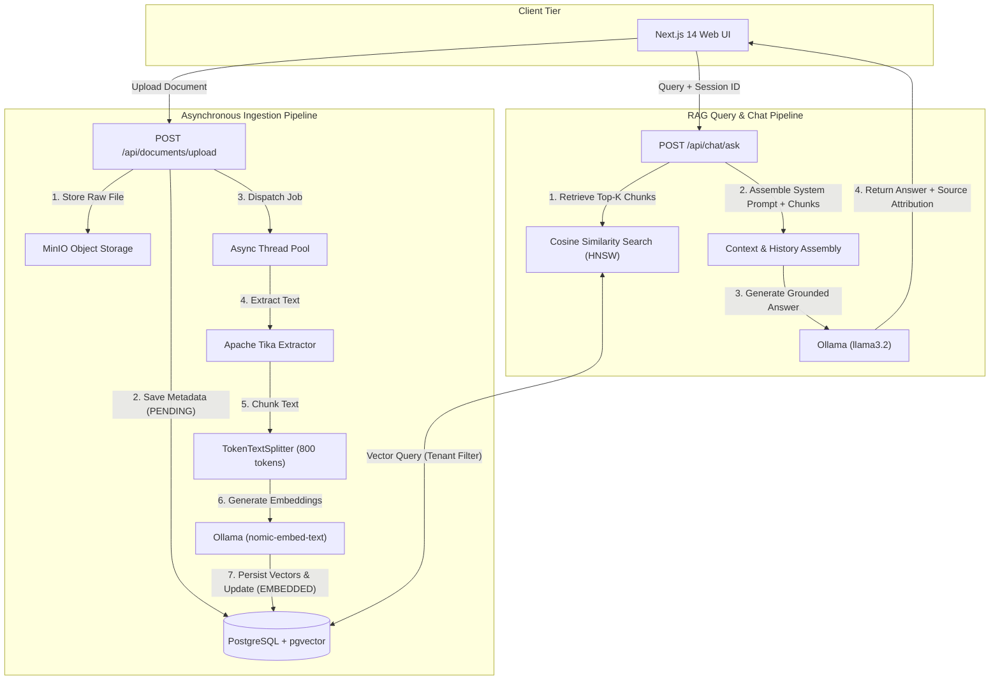

# Nexus

> Enterprise Retrieval-Augmented Generation (RAG) platform with multi-tenant document isolation, asynchronous ingestion, and local LLM reasoning.

[](https://www.oracle.com/java/)
[](https://spring.io/projects/spring-boot)
[](https://www.postgresql.org/)
[](https://github.com/pgvector/pgvector)
[](https://nextjs.org/)
[](https://www.docker.com/)
[](LICENSE)

---

## Overview

Modern organizations manage massive volumes of unstructured operational documents—PDFs, policy manuals, technical specifications, and spreadsheets. Relying on public cloud AI platforms often poses confidentiality and data-sovereignty risks, while raw keyword search fails to answer complex semantic questions.

**Nexus** is a self-hosted, enterprise-grade Knowledge Platform and RAG engine. It couples **Spring Boot** and **Spring AI** with **PostgreSQL + pgvector**, **Ollama**, and **MinIO** to provide localized, private semantic document search and grounded conversational intelligence. The platform enforces strict multi-tenant access control so users can only query documents they own or documents marked as organizationally shared by administrators.

---

## Key Features

- **Format-Agnostic Document Ingestion**: Leverages **Apache Tika** to extract clean text from complex file formats (PDF, DOCX, PPTX, XLSX, HTML, and plain text) rather than naive byte decoding.
- **Asynchronous Ingestion Pipeline**: File uploads return `202 Accepted` immediately. Background worker thread pools process text extraction, chunking, and embedding generation without blocking HTTP threads or holding idle database transactions.
- **pgvector Vector Store**: Embeds document chunks into PostgreSQL with **HNSW (Hierarchical Navigable Small World)** indexing and cosine distance similarity queries.
- **Multi-Tenant Isolation**: Semantic retrieval strictly filters vector embeddings by user identity (`uploaderId`) while allowing administrative users to view and query shared knowledge.
- **Grounded Conversational RAG**: Combines top-$k$ retrieved semantic chunks with rolling conversation history windows to support multi-turn dialogue, strict refusal of ungrounded questions, and transparent document source attribution.
- **S3-Compatible Object Storage**: Original files are stored in **MinIO** with automatic bucket initialization, UUID object keying, and path traversal protection.
- **Stateless JWT Security & RBAC**: Token-based authentication using JJWT, BCrypt password hashing, method-level `@PreAuthorize` security, and seeded developer credentials.
- **Production-Ready Web Frontend**: Built with **Next.js 14**, Tailwind CSS, TanStack Query, and Zustand for real-time document status polling, markdown chat rendering, and session history management.

---

## Architecture



1. **Ingestion**: When a file is uploaded, the backend stores the original object in MinIO, persists a database record with `PENDING` status, and offloads work to an asynchronous executor pool (`documentProcessingExecutor`). The worker downloads the file bytes, parses text via Apache Tika, splits the text into token chunks, generates vector embeddings through Ollama, and inserts them into `pgvector`.
2. **Retrieval**: When a query is received, Nexus filters chunks based on the user's tenant permissions and executes an HNSW cosine similarity search. The retrieved context is injected into a strict system prompt along with previous conversational turns, and sent to Ollama (`llama3.2`) to produce an accurate, grounded answer.

---

## Tech Stack

| Domain | Technology | Description |
|---|---|---|
| **Backend** | Java 21, Spring Boot 3.4.5 | Core enterprise REST API framework |
| **AI Integration** | Spring AI 1.0.0 | Vector store abstractions, chat client, embeddings |
| **Local LLMs** | Ollama | `llama3.2` (Generation), `nomic-embed-text` (Embeddings) |
| **Vector Database**| PostgreSQL 17 + pgvector | Relational database with HNSW vector index support |
| **Object Storage** | MinIO (AWS S3 SDK v2) | S3-compatible document storage for uploaded assets |
| **Text Parsing** | Apache Tika 2.9.2 | Format-aware text extraction for PDFs, DOCX, etc. |
| **Security** | Spring Security, JJWT 0.11.5 | Stateless JWT authentication, RBAC, BCrypt |
| **Database Migrations** | Flyway | Automated database versioning and schema migrations |
| **API Docs** | Springdoc OpenAPI 2.6.0 | Swagger UI and OpenAPI 3.0 specification |
| **Frontend** | Next.js 14.2, React 18, TypeScript | App Router frontend with React Markdown support |
| **Styling & State** | Tailwind CSS, TanStack Query, Zustand | Modern reactive state and responsive dark UI |
| **Containers** | Docker & Docker Compose | Containerized local development and deployment |

---

## Prerequisites

Ensure the following tools are installed before running Nexus locally:

- **Git**
- **Docker** and **Docker Compose** (v2+)
- **Java 21 JDK** (to run the backend natively)
- **Node.js 18+** and **npm** (to run the frontend natively)
- *(Optional)* **Ollama** installed on your host system if not running Ollama inside Docker

---

## Getting Started

### 1. Clone the Repository

```bash
git clone https://github.com/UdayBarman001/Nexus.git
cd Nexus
```

### 2. Configure Environment Variables

Copy the example environment file and adjust configuration values as needed:

```bash
cp .env.example .env
```

*(On Windows PowerShell: `Copy-Item .env.example .env`)*

### 3. Start Infrastructure Services

Launch PostgreSQL (with pgvector), Ollama, and MinIO:

```bash
docker compose up -d postgres ollama minio
```

Verify that all three containers are healthy:

```bash
docker compose ps
```

### 4. Pull Ollama AI Models

Download the chat and embedding models into the Ollama container:

```bash
docker exec -it nexus-ollama ollama pull llama3.2
docker exec -it nexus-ollama ollama pull nomic-embed-text
```

*Note: If you run Ollama natively on your host machine instead of Docker, execute `ollama pull llama3.2` and `ollama pull nomic-embed-text` directly.*

### 5. Run the Backend

In a terminal window:

```bash
cd Backend
./mvnw spring-boot:run
```

*(On Windows: `cd Backend` then `.\mvnw.cmd spring-boot:run`)*

The backend will start on `http://localhost:8080`. Flyway will run schema migrations, Spring AI will configure the vector store, and demo accounts will be initialized automatically.

- **Swagger UI**: [http://localhost:8080/swagger-ui.html](http://localhost:8080/swagger-ui.html)
- **Health Endpoint**: [http://localhost:8080/actuator/health](http://localhost:8080/actuator/health)

### 6. Run the Frontend

In a separate terminal window:

```bash
cd frontend
npm install
npm run dev
```

The frontend web interface will be available at [http://localhost:3000](http://localhost:3000).

### Pre-Configured Demo Accounts

| Role | Email | Password |
|---|---|---|
| **Admin** | `admin@example.com` | `Password123` |
| **User** | `user@example.com` | `Password123` |

MinIO Console is available at [http://localhost:9001](http://localhost:9001) using:
- **Username**: `nexus_admin`
- **Password**: `nexus_minio_pass`

---

## Configuration Reference

| Variable | Default Value | Description |
|---|---|---|
| `JWT_SECRET` | *(Random 256-bit string)* | Base64-encoded secret key for signing JWT tokens |
| `JWT_EXPIRATION_MS` | `86400000` (24h) | JWT expiration time in milliseconds |
| `POSTGRES_DB` | `Nexusdb` | Database name |
| `POSTGRES_USER` | `nexus_user` | Database user |
| `POSTGRES_PASSWORD`| `nexus_pass` | Database password |
| `DB_URL` | `jdbc:postgresql://localhost:5432/Nexusdb` | JDBC connection URL |
| `DDL_AUTO` | `validate` | Hibernate DDL validation mode |
| `MINIO_URL` | `http://localhost:9000` | MinIO endpoint URL |
| `MINIO_ACCESS_KEY` | `nexus_admin` | MinIO access key |
| `MINIO_SECRET_KEY` | `nexus_minio_pass` | MinIO secret key |
| `MINIO_BUCKET` | `nexus-documents` | S3 bucket name for document uploads |
| `OLLAMA_BASE_URL` | `http://localhost:11434` | Ollama service endpoint |
| `CHAT_MODEL` | `llama3.2` | Ollama model name for RAG chat generation |
| `EMBEDDING_MODEL` | `nomic-embed-text` | Ollama model name for vector embeddings |
| `RAG_CHUNK_SIZE` | `800` | Token split chunk size |
| `RAG_TOP_K` | `5` | Number of document chunks retrieved per query |
| `RAG_SIMILARITY_THRESHOLD` | `0.5` | Minimum cosine similarity score threshold |
| `RAG_HISTORY_WINDOW` | `6` | Maximum recent turns loaded into prompt context |
| `SERVER_PORT` | `8080` | Spring Boot HTTP port |
| `CORS_ALLOWED_ORIGINS` | `http://localhost:3000,http://localhost:5173` | Allowed CORS client origins |
| `DEMO_ACCOUNTS_ENABLED` | `true` | Seeds default test accounts at startup |
| `NEXT_PUBLIC_API_URL` | `http://localhost:8080` | Frontend backend API URL |

---

## API Overview

All `/api/documents/**` and `/api/chat/**` endpoints require a Bearer token in the `Authorization` header: `Bearer <token>`.

### Authentication Endpoints

| Method | Endpoint | Auth | Description |
|---|---|---|---|
| `POST` | `/api/auth/register` | Public | Register a new user account |
| `POST` | `/api/auth/login` | Public | Authenticate with credentials and receive a JWT |
| `GET` | `/api/auth/me` | Bearer JWT | Fetch currently authenticated user profile |

### Document Management Endpoints

| Method | Endpoint | Auth | Description |
|---|---|---|---|
| `POST` | `/api/documents/upload` | Bearer JWT | Upload document (`multipart/form-data`) for asynchronous ingestion |
| `GET` | `/api/documents` | Bearer JWT | Paginated list of user documents (`page`, `size`, `status`) |
| `GET` | `/api/documents/stats` | Bearer JWT | Aggregated document counts and total chunk count |
| `GET` | `/api/documents/{id}` | Bearer JWT | Get document details and processing status (`PENDING`, `EMBEDDED`, etc.) |
| `GET` | `/api/documents/{id}/download`| Bearer JWT | Download the original stored document bytes |
| `DELETE`| `/api/documents/{id}` | Bearer JWT | Delete document record, MinIO storage object, and vector chunks |

### RAG Chat Endpoints

| Method | Endpoint | Auth | Description |
|---|---|---|---|
| `POST` | `/api/chat/ask` (or `/api/chat`) | Bearer JWT | Send question (`query` / `question`), optional `sessionId` to continue chat |
| `GET` | `/api/chat/sessions` | Bearer JWT | Paginated list of user chat sessions |
| `GET` | `/api/chat/sessions/{id}/messages` | Bearer JWT | Fetch ordered message history for a given chat session |
| `PATCH`| `/api/chat/sessions/{id}` | Bearer JWT | Rename a chat session title |
| `DELETE`| `/api/chat/sessions/{id}` | Bearer JWT | Delete a chat session and all associated messages |

---

## Project Structure

```
Nexus/
├── Backend/                                # Spring Boot Application
│   ├── src/
│   │   ├── main/
│   │   │   ├── java/com/Let/s_Code/nexus/
│   │   │   │   ├── config/                 # Security, CORS, MinIO, RAG, OpenAPI, Async configs
│   │   │   │   ├── controller/             # AuthController, DocumentController, ChatController
│   │   │   │   ├── dto/                    # Request/Response data transfer objects
│   │   │   │   ├── Entity/                 # JPA Entities (User, Document, ChatSession, ChatMessage)
│   │   │   │   ├── exception/              # GlobalExceptionHandler and custom exceptions
│   │   │   │   ├── Repository/             # Spring Data JPA repositories
│   │   │   │   └── service/                # Ingestion, Vectorization, Tika, MinIO, Chat services
│   │   │   └── resources/
│   │   │       ├── db/migration/           # Flyway SQL migrations (V1__init_schema.sql)
│   │   │       ├── application.properties  # Base configuration with environment overrides
│   │   │       └── application-docker.properties
│   │   └── test/                           # Unit and integration test suite (46 tests)
│   ├── Dockerfile                          # Multi-stage Eclipse Temurin Java 21 build
│   └── pom.xml                             # Maven build configuration
├── frontend/                               # Next.js 14 Frontend Application
│   ├── src/
│   │   ├── api/                            # Axios API client bindings (auth, documents, chat)
│   │   ├── app/                            # Next.js App Router pages (login, register, chat, documents)
│   │   ├── components/                     # UI components (chat view, sidebar, header, providers)
│   │   ├── lib/                            # Axios client interceptors, utility functions
│   │   ├── store/                          # Zustand state stores (auth, chat session)
│   │   └── types/                          # TypeScript interface definitions
│   └── package.json
├── docker-compose.yml                      # Infrastructure orchestration (Postgres, Ollama, MinIO, Backend)
├── .env.example                            # Configuration environment template
├── .gitignore                              # Comprehensive monorepo gitignore
├── LICENSE                                 # MIT License
└── README.md                               # Project documentation
```

---

## Roadmap

- [ ] **Organization & Team-Level Document Sharing**: Add workspace/team entity modeling to share documents with granular read/write permissions.
- [ ] **Server-Sent Events (SSE) Streaming**: Stream tokens directly from Ollama via Spring WebFlux / SSE for immediate typewriter rendering in the UI.
- [ ] **Streaming Ingestion**: Stream large multi-gigabyte uploads directly to MinIO and Tika parsers instead of loading byte arrays into memory.
- [ ] **Cross-Encoder Reranking**: Implement a second-stage reranker (e.g., bge-reranker) to re-order top-$k$ retrieved chunks before prompt construction.
- [ ] **Hybrid Search**: Combine PostgreSQL full-text search (`tsvector` / BM25) with pgvector semantic similarity for high-accuracy keyword and acronym matching.

---

## Contributing

Contributions are welcome. Please open an issue to discuss proposed changes or submit a pull request with unit tests covering any new functionality.

1. Fork the repository
2. Create your branch (`git checkout -b feature/amazing-feature`)
3. Commit your changes (`git commit -m 'feat: add amazing feature'`)
4. Push to the branch (`git push origin feature/amazing-feature`)
5. Open a Pull Request

---

## License

This project is licensed under the MIT License — see the [LICENSE](LICENSE) file for details.

---

## Author

**Uday Barman**  
- **GitHub**: [@UdayBarman001](https://github.com/UdayBarman001)  
- **LinkedIn**: [linkedin.com/in/uday-barman-648787250](https://www.linkedin.com/in/uday-barman-648787250/)
